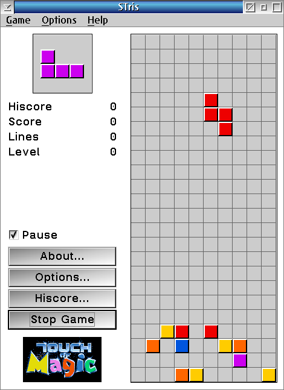

# STris for ArcaOS / eComStation / OS/2

STris is a Tetris clone for the OS/2 Presentation Manager.
Originally written by Rene Straub in 1995-1996 (version 1.45).



## Version

1.50

## License

GNU General Public License v3 - see `doc/LICENSE.txt`

## Features

- Tetris gameplay with 7 standard pieces
- Optional random "extra squares" at the bottom when a game starts
- Three detail levels (High, Medium, Low) affecting rendering detail
- High-score table with name entry
- 6-language interface **and** online help: English, Spanish, Dutch, German, French, Italian (switch at runtime in Options - Language)
- Configurable key bindings
- Sound effects (OS/2 multimedia), on by default
- The game pauses automatically on focus loss (unless Background Run is on)
- Frame Controls toggle (Ctrl+F) for borderless play; the window resizes itself
- Settings saved to `STris.cfg` on exit (can be switched off)

## Keys

Default: Left / Right arrows move, Up rotates, Down drops faster (change them in Options - Define Keys).

| Shortcut | Action |
|----------|--------|
| Ctrl+N | New game (ignored while a game is running) |
| Ctrl+P | Pause / resume |
| Ctrl+Q | Quit the current game (asks first) |
| Ctrl+X | Exit |
| Ctrl+B | Background Run on/off |
| Ctrl+F | Frame Controls on/off |
| F1 | Help |

## Start with extra squares

Options - Settings - "Start with extra squares" fills the bottom of the playfield with random squares when a game starts: one row per Startlevel, or 4 rows if Startlevel is 0. Switch it off to start with an empty playfield.

## Installation

Run `STris.exe`. Keep the `help\` folder (one `.hlp` per language) and the `Sounds\` folder (the `.wav` effects) next to it. `STris.cfg` and the high-score file are created in the folder you start the program from.

## Compile Tools

- OpenWatcom 2.0 (`wmake`, `wcc386`, `wlink`, `wrc`, `wipfc`)
- OS/2 Toolkit 4.5

## Build

```
compile-wat.cmd
```

Output: `bin\STris.exe` and `bin\help\STris_xx.hlp`

## Requirements

- OS/2 Warp 4, eComStation, or ArcaOS
- 32-bit Presentation Manager
- OS/2 Multimedia (for sound effects)

## Authors

- Original: Rene Straub - 1995-1996
- OS/2 port: OS2World community - 2026

## Links

- OS2World: https://www.os2world.com
